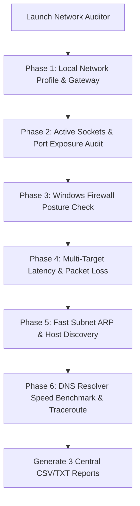

# 04. Network Security, Open Port Exposure & Socket Auditor (6-Phases)

## 📌 Executive Summary
The **Network Security, Open Port Exposure & Socket Auditor** (`network_auditor/audit_network.ps1`) is a deep, 6-phase forensic network auditing suite. It scans the host for exposed listening ports, maps them to running processes/services, audits firewall profile postures, maps the local subnet, runs network latency tests, and benchmarks DNS resolver speeds.

---

## 🏗️ Architecture & Script Mapping

- **Primary Script**: `network_auditor/audit_network.ps1`
- **Batch Launcher**: `network_auditor/run_network_audit.bat`
- **Master Menu Option**: `[4]`
- **Direct Web Shortcut**: `irm https://toolkit.omvihub.in/netaudit | iex`

---

## 🔍 The 6 Audit Phases Explained

1. **Phase 1: Network Configuration & Gateway Health**:
   - Audits active NICs, MAC addresses, IPv4/IPv6 gateways, DNS server IPs, and link speeds.

2. **Phase 2: Listening Sockets & Port Exposure**:
   - Parses `netstat -ano -p tcp` and `Get-NetTCPConnection`.
   - Resolves PID $\rightarrow$ Process Name $\rightarrow$ Executable Path.
   - Evaluates risk levels for high-risk ports (`3389` RDP, `445` SMB, `135` RPC, `1433` SQL, `21` FTP, `23` Telnet).

3. **Phase 3: Windows Firewall Profile Analysis**:
   - Inspects Domain, Private, and Public firewall profiles (`Get-NetFirewallProfile`).
   - Flags open incoming rules and promiscuous port exemptions.

4. **Phase 4: Latency & Packet Loss Audit**:
   - Tests ping latency against Local Gateway, Public DNS (`8.8.8.8`, `1.1.1.1`), and Cloud endpoints (`microsoft.com`, `github.com`).
   - Calculates Min/Avg/Max latency and packet loss percentage.

5. **Phase 5: Subnet Discovery & ARP Inspection**:
   - Scans the `/24` subnet for active hosts and resolves MAC addresses.

6. **Phase 6: DNS Resolver Benchmark & Traceroute**:
   - Measures query resolution response times across Local DNS, Google DNS, Cloudflare DNS, Quad9, and OpenDNS.
   - Executes a 6-hop traceroute to evaluate gateway hop latency.

---

## 📊 Generated Reports

- **Security Report**: `C:\SysMaster\reports\network_security_report_<ComputerName>.csv`
- **Subnet Inventory**: `C:\SysMaster\reports\subnet_scan_<ComputerName>_<Timestamp>.csv`
- **Diagnostics Summary**: `C:\SysMaster\reports\network_diagnostics_<ComputerName>_<Timestamp>.txt`
