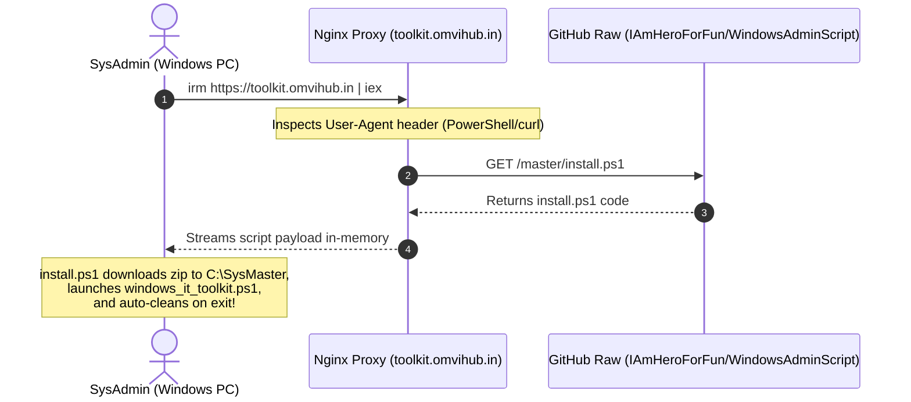

# 16. Web Bootstrap, TLS/SSL & Nginx Deployment Guide

## 📌 Executive Summary
The **Web Bootstrap & Cloud In-Memory Deployment Architecture** allows any Windows client to execute the toolkit or any sub-module instantly via a short one-liner command (similar to Microsoft Massgrave `irm https://massgrave.dev/get | iex`).

This infrastructure is powered by an Nginx reverse proxy running on AWS Lightsail, protected with Let's Encrypt TLS 1.2/1.3 SSL certificates, routing PowerShell requests dynamically to raw GitHub repositories.

---

## 🌐 How the Web One-Liner Works



---

## 🔒 Nginx Reverse Proxy Configuration (`toolkit.conf`)

Located on the Linux host / container:
- **Server Name**: `toolkit.omvihub.in`
- **Port**: `443 ssl` (HTTP redirects to HTTPS 301)
- **SSL Certificates**: `/etc/letsencrypt/live/toolkit.omvihub.in/fullchain.pem`
- **Compression Rule**: `proxy_set_header Accept-Encoding "";` (Prevents gzip encoding issues inside PowerShell's `Invoke-RestMethod`).
- **Dynamic Sub-filter Engine**: Rewrites URL shortcuts (e.g. `/pst`, `/search`, `/office`, `/sql`, `/sharing`) to pre-set `$Tool` variables in `install.ps1` before streaming to the client.

---

## 🚀 Server Deployment & Verification Commands

### Test Nginx Configuration:
```bash
docker exec omvi_blog-nginx-1 nginx -t
```

### Reload Nginx Service:
```bash
docker exec omvi_blog-nginx-1 nginx -s reload
```

### Live Test from CachyOS / Linux:
```bash
curl -sSL -A "PowerShell" https://toolkit.omvihub.in/pst | head -n 25
```
