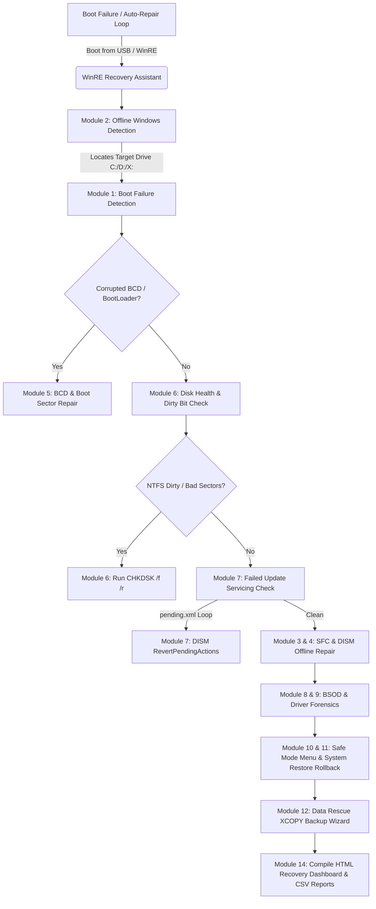

# 🚑 WinRE Recovery Assistant [Option 15]

A recovery-focused diagnostic and boot repair platform engineered by Senior Microsoft Support Engineers and Windows Infrastructure Specialists. Designed to diagnose, repair, and recover Windows 10/11 and Windows Server systems stuck in Automatic Repair loops, BSOD boot loops, corrupted BCD states, failed update loops, and Safe Mode failures.

---

## 🛑 Strict Safety Architecture: Never Repair Without Approval

By design, **WinRE Recovery Assistant NEVER executes system repairs or modifications automatically**. Every single diagnostic finding follows a strict three-step protocol:
1. **Detect Likely Root Cause** (e.g., corrupted BCD store or dirty NTFS volume).
2. **Generate Recovery Recommendation** (e.g., recommend `bootrec /rebuildbcd` or `chkdsk /f /r`).
3. **Prompt for Explicit Confirmation** (`Execute Repair? [Y/N]`).
   * **If No**: The recommendation is logged to `reports\recovery.log` as skipped without modifying any files.
   * **If Yes**: The command is executed, timed, and recorded in `reports\repair_history.csv`.

### Three Execution Modes
* `-Mode AuditOnly`: Evaluates all 14 modules, logs findings, and builds reports without prompting or modifying anything.
* `-Mode AskBeforeRepair` *(Default)*: Interactive mode prompting `[Y/N]` before any repair action.
* `-Mode ExpertRepair`: Auto-executes critical recovery commands for disaster recovery automation.

---

## 🏗️ Recovery Architecture Diagram



---

## 🔍 14 Comprehensive Diagnostic & Recovery Modules

1. **Boot Failure Detection**: Checks for missing `winload.efi`/`winload.exe`, corrupted BCD tables, missing EFI partitions, and recurring event log startup repair loops.
2. **Offline Windows Detection**: Automatically scans all logical drive volumes (`C:`, `D:`, `E:`, `X:`) to locate active and offline Windows installations, extracting OS build and version metadata.
3. **System File Corruption Analyzer**: Recommends and executes offline System File Checker (`sfc /scannow /offbootdir=X:\ /offwindir=X:\Windows`).
4. **DISM Recovery Engine**: Evaluates component store health and executes offline servicing repair (`DISM /Image:X:\Windows /Cleanup-Image /RestoreHealth`).
5. **Boot Configuration Repair**: Audits BCD store integrity and executes `bootrec /fixmbr`, `bootrec /fixboot`, `bootrec /rebuildbcd`, and `bcdboot`.
6. **Disk Health & Filesystem Audit**: Queries NTFS dirty bit (`fsutil dirty query`), evaluates SMART health, and executes `chkdsk /f /r /x`.
7. **Failed Windows Update Recovery**: Detects stuck servicing loops (`Windows\WinSxS\pending.xml`) and executes `DISM /RevertPendingActions`.
8. **Driver Failure Analyzer**: Scans `System32\drivers` for known BSOD trigger drivers (`nvlddmkm.sys`, `iastor.sys`, `rtwlane.sys`, `igdkmd64.sys`) and recently updated `.sys` files.
9. **BSOD Forensics**: Analyzes `Windows\Minidump` and `MEMORY.DMP` files, extracting BugCheck codes (`0x0000007E`, `0x0000003B`), faulting drivers, and heuristic confidence percentages.
10. **Safe Mode Recovery**: Provides an interactive boot configuration menu to force **Safe Mode Minimal**, **Safe Mode with Networking**, or restore normal boot (`bcdedit /set {default} safeboot minimal`).
11. **System Restore Audit**: Enumerates Volume Shadow Copy (`VSS`) system restore snapshots and launches the rollback wizard (`rstrui.exe`).
12. **Data Rescue Assistant**: Identifies user profiles (`Desktop`, `Documents`, `Pictures`) and provides an interactive `XCOPY` backup wizard to copy files to an external USB or NAS drive.
13. **Recovery Environment Audit**: Verifies Windows Recovery Environment status (`reagentc /info`) and enables WinRE if disabled.
14. **HTML Recovery Dashboard**: Compiles a self-contained, dark-mode visual dashboard (`recovery_dashboard.html`) with zero external CDN dependencies.

---

## 💽 WinRE Integration & USB Boot Version Guide

### 1. Integrating into Windows Recovery Environment (WinRE)
To embed this tool directly into a server or workstation's local WinRE partition:
1. Mount the local WinRE image (`Winre.wim` located in `C:\Recovery\WindowsRE`):
   ```cmd
   dism /mount-image /imagefile:C:\Recovery\WindowsRE\Winre.wim /index:1 /mountdir:C:\WinRE_Mount
   ```
2. Copy the `winre_recovery_assistant` folder into `C:\WinRE_Mount\Windows\System32\`.
3. Unmount and commit changes:
   ```cmd
   dism /unmount-image /mountdir:C:\WinRE_Mount /commit
   reagentc /disable && reagentc /enable
   ```
4. When booting into Advanced Startup -> Command Prompt, simply type `winre_recovery_assistant.ps1`!

### 2. Creating an Emergency USB Bootable Recovery Drive
To create a bootable USB technician thumb drive:
1. Insert an empty USB flash drive (8GB+) and format it as FAT32 / NTFS using Windows Media Creation Tool or Rufus.
2. Copy the entire `D:\projects\script` toolkit root folder onto the USB drive root (`E:\IT_Toolkit\`).
3. Boot any broken PC from the USB drive into Windows Setup / WinRE.
4. Press **Shift + F10** to open Command Prompt.
5. Navigate to the USB drive and launch:
   ```cmd
   E:\IT_Toolkit\winre_recovery_assistant\run_winre_recovery_assistant.bat
   ```

---

## 📊 Generated Reports & Logs (`reports\`)

* `recovery_dashboard.html`: Self-contained dark-mode HTML interactive recovery command center.
* `boot_failure_report.csv`: CSV inventory of detected boot loader and BCD faults.
* `disk_health_report.csv`: NTFS volume dirty bit and SMART health check results.
* `driver_analysis.csv`: Itemized risk assessment of installed kernel `.sys` drivers.
* `bsod_analysis.csv`: Crash dump BugCheck extraction and faulting driver analysis.
* `repair_history.csv`: Audit log of all approved and executed repair commands.
* `recovery_summary.csv`: Master executive summary of detected problems and remediation statuses.
* `recovery.log`: Timestamped plaintext execution log recording every user `[Y/N]` decision.

---

## 🗺️ Future Roadmap

* **Q3 2026**: Automated BitLocker recovery key detection and unlocking via Azure AD / Active Directory backup query.
* **Q4 2026**: Integration with Microsoft DaRT (Desktop Diagnostics and Recovery Toolset) network boot PXE environments.
* **Q1 2027**: Automated EFI partition reconstruction wizard for completely deleted UEFI boot partitions.
